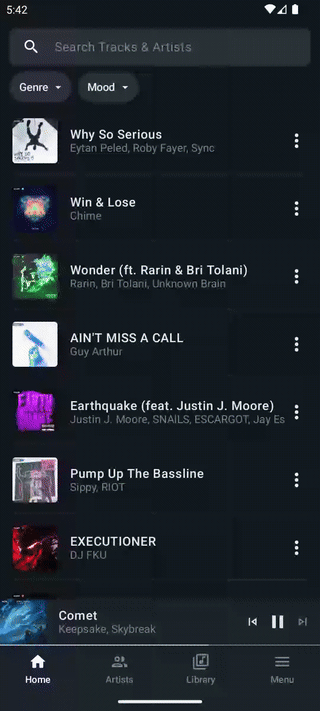
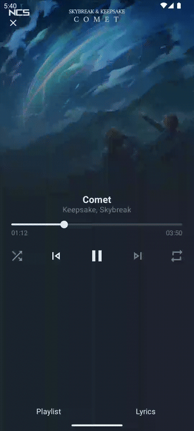

# NCS (NoCopyrightSounds)

### 📝 Summary
[NCS (NoCopyrightSounds)](https://ncs.io/) 전용 플레이어

### ✅ Features
- [x] 음악 검색 및 Genre, Mood로 필터링
- [x] 음악 재생
- [x] 가사 보기
- [x] 플레이리스트 관리 및 재생
- [x] 음악 순서 변경

<p>




</p>


### 📝 Todos
<details>
<summary>접기/펼치기</summary>

- [x] 음악 상세 페이지
- [x] 아티스트 상세 페이지
- [ ] Light, Dark 모드
- [x] 오픈소스 표기 페이지
- [ ] Fandom wiki path 검토
- [ ] 백엔드 추가
    - [ ] 검색 및 필터링 변경
    - [ ] 추천 기능
- [ ] 플레이리스트 제목 글자수 유효성
- [ ] 플레이리스트 선택시 새로운 플레이리스트 추가
- [ ] 음악 클릭하여 재생(설정에서 변경 가능)
- [ ] 음악 디테일 페이지 - 가사 없을 때 문구
- [ ] 음악, 아티스트 리스트 페이지 - 결과 없을 때 문구
- [x] 음악 선택시 선택한 개수 표시
- [ ] 페이지 전환 애니매이션
- [ ] 디테일 페이지 히스토리 처리
- [ ] 플레이 화면에서 음악, 아티스트 디테일 이동시 뒤로 왔을 때 작아지는 현상 수정
- [ ] 다운로드 기능
  - [x] 사용자가 직접 파일 다운로드
  - [x] 재생할 음악, 재생중인 음악 캐싱
  - [x] 캐싱 기능 on / off
  - [x] 캐싱 max size 지정
  - [ ] 사용자가 다운로드 한 음악, 캐싱된 음악 삭제 페이지 (필터링으로 구분)
- [x] 플레이어 음악 리스트에서 음악 클릭시 클릭한 음악 재생
- [x] 플레이 리스트 상세 페이지에서 음악 클릭시 재생
</details>


### 🛠️ Tech
`Compose`, `Media3`, `Hilt`, `Coroutines`, `Flow`, `Retrofit`, `Room`, `Coil`, `Unit Test`

### 📖 How to run
- `local.properties`파일에 아래 항목 추가
- add the below data to `local.properties`
```
WEB_URL="https://ncs.io"
FANDOM_URL="https://nocopyrightsounds.fandom.com"
```


> #### For release mode
1. `app`디렉토리에 keystore 파일 추가
- add keystore file to `app` directory 

2. `root`디렉토리에 `keystore.properties`파일 추가, keystore 정보 입력
- add `keystore.properties` file to `root` directory and write keystore data following below
```
RELEASE_KEY_STORE={KEY_STORE_FILE_NAME}
RELEASE_KEY_PASSWORD={KEY_STORE_KEY_PASSWORD}
RELEASE_KEY_ALIAS={KEY_STORE_KEY_ALIAS}
RELEASE_KEY_ALIAS_PASSWORD={KEY_STORE_ALIAS_PASSWORD}

# example
# RELEASE_KEY_STORE=ncs.keystore
# RELEASE_KEY_PASSWORD=my_password
# RELEASE_KEY_ALIAS=alias0
# RELEASE_KEY_ALIAS_PASSWORD=alias0_password
```


### 📱 Result

<p>


</p>